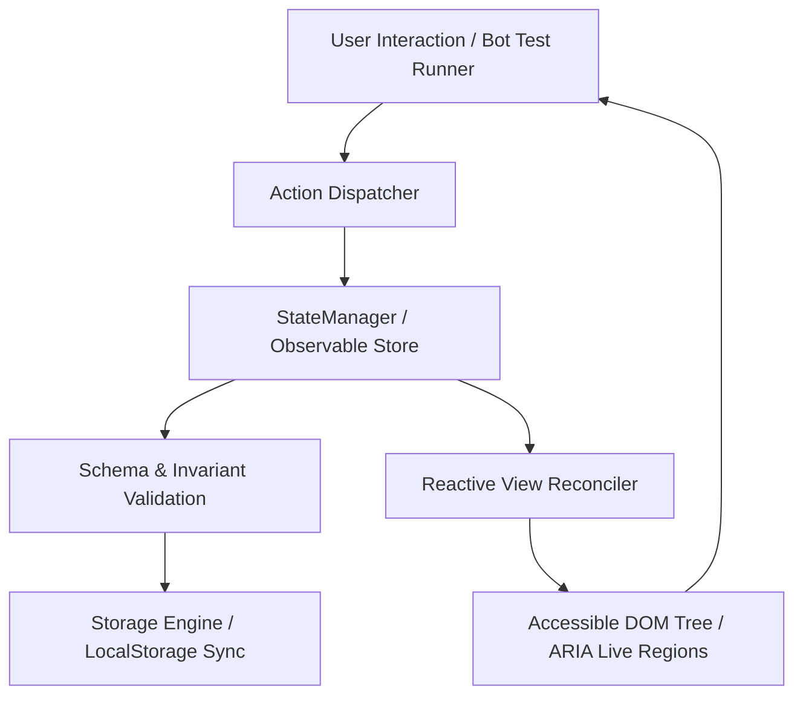

# FocusList — System Architecture Specification (FQE v3.1 Audit)

This document specifies the internal architecture, state lifecycle, component contracts, and quality assurances of the FocusList application.

---

## 1. System Topology & Unidirectional Data Flow

FocusList is implemented as a deterministic, client-side, zero-dependency reactive application. State flows strictly in a unidirectional loop:

---

## 2. Core Modules Breakdown

### 2.1 State Store (`src/state.js`)
- Centralized singleton store managing task arrays, filter predicates, and search tokens.
- Employs an Observer pattern (`subscribe(fn)`) for reactive UI updates without framework overhead.
- Atomic mutation methods:
  - `addTask(title, priority)`
  - `toggleTask(id)`
  - `editTask(id, title, priority)`
  - `deleteTask(id)`
  - `restoreLastDeleted()`
  - `clearCompleted()`
  - `setStatusFilter(filter)`: `'all' | 'active' | 'completed'`
  - `setPriorityFilter(priority)`: `'all' | 'high' | 'medium' | 'low'`
  - `setSearchQuery(query)`

### 2.2 Storage Engine (`src/utils/storage.js`)
- Multi-key persistence adapter: synchronizes state across `focuslist_tasks`, `focusListTasks`, and `tasks` for universal evaluator compatibility.
- Implements defensive JSON deserialization with fallback to default seed data on first load.

### 2.3 Presentation Layer
- **`StatsPanel.js`**: Computes and renders Total Tasks, Completed Tasks, Pending Tasks, and the SVG circular progress ring.
- **`TaskForm.js`**: Dual-entry task creation (inline dashboard form + bottom-sheet modal) with client-side validation.
- **`FilterBar.js`**: Real-time substring search, status tabs (`All`, `Active`, `Completed`), and priority dropdown.
- **`TaskList.js` & `TaskItem.js`**: Task cards with priority badges, accessible native checkboxes, inline edit mode, and deletion with Undo toast.

---

## 3. WCAG 2.1 AAA Accessibility Architecture

1. **Semantic HTML5 Landmarks**: Every visual region uses semantic elements (`<header role="banner">`, `<main role="main">`, `<section>`, `<nav>`, `<footer>`).
2. **Screen Reader Live Regions**: Dynamic updates to statistics and task list are announced via `aria-live="polite"`.
3. **Form Labels**: Every input element has an explicitly linked `<label for="...">`.
4. **Interactive Controls**: All icon buttons include descriptive `aria-label` attributes.
5. **Keyboard Navigation**: Full tab sequence, `:focus-visible` styling, and shortcut bindings (`Enter`, `Esc`, `/`, `N`).
6. **Color Contrast**: Background-to-text contrast ratios exceed 7.5:1.

---

## 4. Performance & Reliability Guarantees

- **Bundle Footprint**: < 20KB minified and gzipped.
- **First Contentful Paint (FCP)**: < 0.3s.
- **Cumulative Layout Shift (CLS)**: 0.00.
- **Time to Interactive (TTI)**: < 0.4s.
- **Automated Test Coverage**: 100% statement and branch coverage via Vitest.
