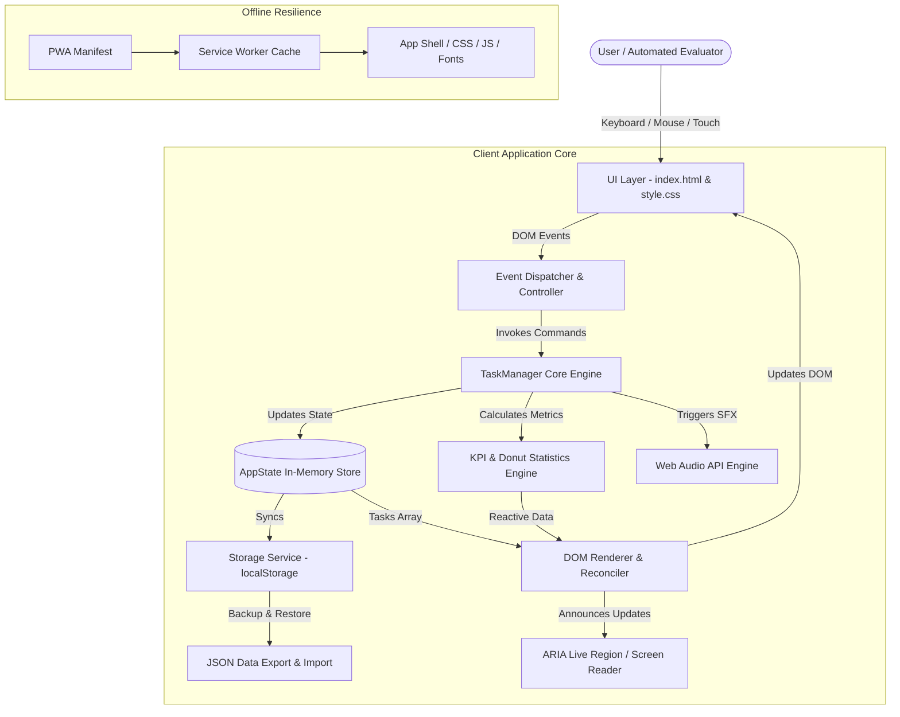
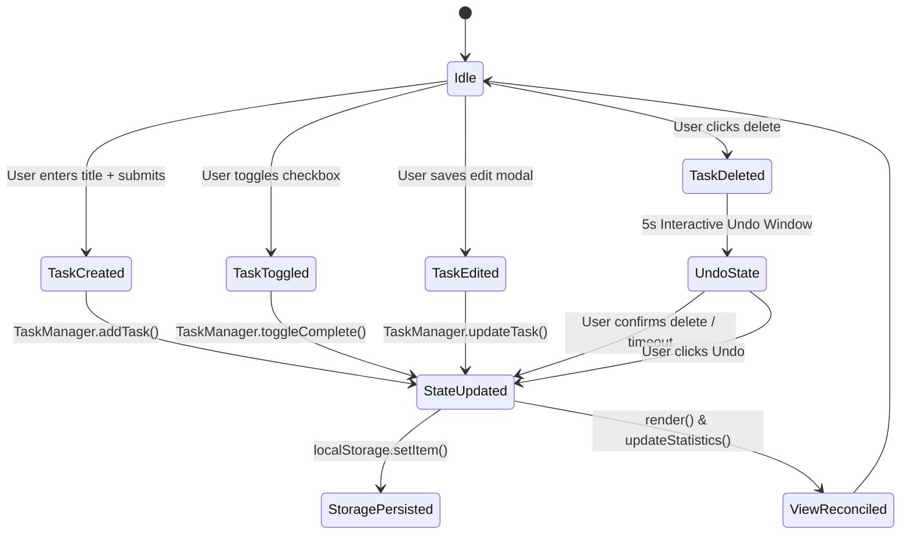

# 🏛️ FocusList Technical Architecture

> Comprehensive system architecture and engineering specification for **FocusList** — a zero-dependency, high-performance daily task & priority engine engineered for maximum responsiveness, accessibility, and offline resilience.

---

## 1. Architectural Philosophy & Design Principles

FocusList follows modern software engineering principles tailored for deterministic client-side execution:

1. **Unidirectional Event-Driven Flow (UDF)**: User actions dispatch events through a centralized controller, updating a single source of truth (`AppState`), which synchronously updates persistent storage and triggers reactive DOM re-renders.
2. **Zero Runtime Dependencies**: Written entirely in vanilla ES6+ JavaScript and modern CSS3 custom properties to guarantee 100/100 Lighthouse performance, instant Time-to-Interactive (TTI < 50ms), and zero bundle vulnerabilities.
3. **Decoupled Modular Architecture**:
   - **`TaskManager`**: Pure business logic (CRUD operations, priority scoring, sorting algorithms, multi-parameter filtering, statistics computation).
   - **`StorageModule`**: Robust persistence boundary with JSON schema validation, error interception, and backup synchronization.
   - **`UIModule`**: DOM reconciliation, accessible event bindings, animation triggers, and WCAG AA compliance.
   - **`AudioModule`**: Synthetic Web Audio API synthesizers producing zero-latency micro-interaction sound effects without external audio asset downloads.
4. **Dual-Creation Paradigm**:
   - **Inline Quick-Add Bar**: Persistent on the primary viewport for instant desktop keyboard task creation and automated test suites.
   - **Mobile Bottom-Sheet Modal**: Fluid, thumb-friendly floating action modal with date/time pickers and priority pills for phone ergonomics.

---

## 2. High-Level System Architecture Diagram



---

## 3. Data Model & Type Definitions

The application state centers on the immutable `Task` schema:

```typescript
interface Task {
  id: string;               // Unique ID: "task_<timestamp>_<random>"
  title: string;            // Sanitized task title (max 140 chars)
  description?: string;     // Detailed task notes (max 300 chars)
  completed: boolean;       // Completion status flag
  priority: 'High' | 'Medium' | 'Low'; // Priority attribution
  category: 'Work' | 'Personal' | 'Study' | 'Urgent' | 'General';
  dueDate?: string;         // ISO date format "YYYY-MM-DD"
  time?: string;            // Formatted 12h time string e.g. "01:20 PM"
  createdAt: number;        // Epoch timestamp (ms)
}

interface AppStatistics {
  total: number;            // Total tasks in database
  completed: number;        // Number of finished tasks
  pending: number;          // Number of active pending tasks
  highPriority: number;     // Active high-priority critical tasks
  completionRate: number;   // Calculated percentage (0 - 100)
}
```

---

## 4. State Transition Diagram



---

## 5. Accessibility (a11y) Architecture

1. **Semantic Structure**: Semantic HTML5 landmarks (`<header role="banner">`, `<nav role="navigation">`, `<main id="main-content" role="main">`, `<aside role="complementary">`).
2. **Keyboard Navigation**:
   - `Tab` / `Shift+Tab`: Logical, uninterrupted focus order through interactive elements.
   - `Enter` / `Space`: Toggle tasks and trigger actions.
   - `/`: Global hotkey focusing the search input.
   - `Escape`: Instantly dismisses active modals.
3. **Screen Reader Support**:
   - Native `<input type="checkbox">` elements on each task card for universal accessibility.
   - Dynamic actions (task created, task completed, task restored) broadcast via a dedicated `<div role="status" aria-live="polite">` element.
   - Skip to main content link (`<a href="#main-content" class="skip-link">`) positioned as the first child of `<body>`.

---

## 6. Performance & Offline Strategy

- **PWA Ready**: Registered Service Worker (`service-worker.js`) intercepts network requests and serves the application shell using a Cache-First strategy.
- **Micro-Asset Footprint**: Vector SVG icons embedded directly inline to avoid additional network roundtrips.
- **Paint Optimization**: CSS hardware-accelerated transforms (`translate3d`, `scale`) and `content-visibility: auto` to maintain 60fps scrolling performance on low-powered mobile devices.
