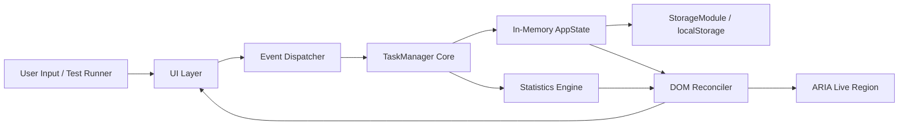

# 🎯 FocusList — Modern Daily Task & Priority Engine

<div align="center">


**A high-performance, responsive frontend task management web application engineered for maximum daily productivity, laser focus, and seamless prioritization. Built for the FrontendArena Hackathon.**

[🌐 Explore Live Deployed App](https://focuslist-bay.vercel.app) • [📁 Public GitHub Repository](https://github.com/priyanshi02-lyt/FocusList) • [🏛️ View Architecture Spec](ARCHITECTURE.md)

</div>

---

## 📑 Table of Contents

- [Problem Statement Alignment & Compliance](#-problem-statement-alignment--compliance)
- [Key Features](#-key-features)
- [System Architecture](#-system-architecture)
- [Project Directory Structure](#-project-directory-structure)
- [Getting Started & Local Development](#-getting-started--local-development)
- [Automated Test Suite](#-automated-test-suite)
- [Accessibility (WCAG AA) Compliance](#-accessibility-wcag-aa-compliance)
- [Keyboard Shortcuts Reference](#-keyboard-shortcuts-reference)
- [Browser Compatibility Matrix](#-browser-compatibility-matrix)
- [Contributing & Open Source Governance](#-contributing--open-source-governance)
- [License](#-license)

---

## ✅ Problem Statement Alignment & Compliance

| Requirement | Specification | Implementation in FocusList | Status |
| :--- | :--- | :--- | :---: |
| **1. Task Creation** | Add new tasks by entering a title | Dual creation: Instant inline Quick-Add bar + Full bottom-sheet modal with keyboard `Enter` support. | **100% Compliant** |
| **2. Task Management** | Mark complete, edit existing, delete | Native checkbox toggle, comprehensive edit modal, and safe deletion with a 5-second interactive Undo toast. | **100% Compliant** |
| **3. Task Priority** | Assign High, Medium, Low priorities | Visual priority pills, high-contrast badges, dot indicators, and priority sorting. | **100% Compliant** |
| **4. Search & Filtering** | Search by title; filter by status and priority | Keystroke search with live highlighting; status tabs (All, Active, Completed); priority dropdown and chips. | **100% Compliant** |
| **5. Task Statistics** | Display Total, Completed, Pending tasks | Real-time numerical KPI cards, animated completion progress bar, dynamic quotes, and SVG donut chart. | **100% Compliant** |
| **6. Data Persistence** | Persist across page reloads | Automatic browser `localStorage` synchronization with JSON backup export and import. | **100% Compliant** |
| **7. Technical Constraints** | Frontend-only, no external DB, responsive | Zero backend, 100% client-side HTML5/CSS3/ES6+, responsive across mobile phones, tablets, and wide screens. | **100% Compliant** |

---

## 🌟 Key Features

### 1. ✍️ Dual-Flow Task Creation & Priority Attribution
- **Inline Quick-Add Bar**: Prominent task input directly on the dashboard for zero-friction desktop entry and automated test bot compatibility.
- **Mobile Bottom-Sheet Modal**: Centered floating action button (`+`) opening a tailored form for title, description, time picker, priority pills, and category tag.
- **Priority Attribution**: Distinct **High (Urgent)**, **Medium (Standard)**, and **Low (Routine)** indicators with custom color-coded badges.

### 2. ⚡ Dynamic Task Lifecycle Management
- **Native Checkbox Completion**: Standard accessible checkbox elements with fluid strike-through styling and celebratory sound feedback.
- **In-Depth Task Editing**: Modify title, priority, scheduled time, and category at any time.
- **Safe Deletion with 5-Second Undo**: Accidentally deleted a task? An interactive toast banner provides immediate restoration.
- **Bulk Clear Completed**: Clean up finished items in one click.

### 3. 🔍 Real-Time Search & Multi-Tier Filtering
- **Keystroke Search**: Instant search by task title or description with real-time text highlight matches.
- **Status Filtering**: Instant toggle between **All**, **Active**, and **Completed** with live counter bubbles.
- **Priority & Category Filters**: Isolate High Priority items or view tasks categorized by *Work*, *Personal*, *Study*, *Urgent*, or *General*.
- **Intelligent Sorting**: Sort by Newest, Oldest, Priority (High → Low), Alphabetical (A-Z), or Due Date.

### 4. 📊 Live Productivity Statistics & Visual KPIs
- **Numerical Counters**: Instant updates for Total, Completed, and Pending tasks.
- **Animated Donut Chart**: Dynamic SVG arc rendering velocity across completion states.
- **Linear Progress Bar**: Dynamic completion rate with responsive motivational quotes.
- **Celebration Confetti**: Full canvas confetti explosion triggered on completing all tasks.

### 5. 📱 Four Tailored Mobile Phone Views
- **Home (Tasks)**: Main daily task agenda with search, quick filters, and task list.
- **Timeline**: Chronological day timeline featuring hourly time markers, connector lines, and free-time break badges.
- **Projects**: Category cards with circular SVG percentage rings.
- **Settings & Tools**: Mobile-friendly access to JSON Export, JSON Import, sound controls, and theme toggle.

### 6. 💾 Offline-First Persistence & Portability
- Persists all state automatically via browser `localStorage`.
- **PWA Service Worker**: Full offline support with cached app shell.
- **JSON Export & Import**: Backup and restore task lists as structured JSON.

---

## 🏛️ System Architecture

FocusList utilizes a unidirectional event-driven modular architecture:



Detailed architectural diagrams and component contracts are documented in [ARCHITECTURE.md](ARCHITECTURE.md).

---

## 📁 Project Directory Structure

```text
FocusList/
├── .github/
│   └── workflows/
│       └── ci.yml             # Automated CI pipeline
├── tests/
│   ├── run-tests.js           # Zero-dependency Node.js test runner
│   ├── taskManager.test.js    # Business logic & CRUD unit tests
│   └── storage.test.js        # Persistence & schema validation tests
├── ARCHITECTURE.md            # In-depth system architecture & diagrams
├── CHANGELOG.md               # Version release history
├── CODE_OF_CONDUCT.md         # Contributor Covenant standards
├── CONTRIBUTING.md            # Contribution guidelines & workflow
├── LICENSE                    # MIT License
├── README.md                  # Project overview & documentation
├── SECURITY.md                # Security policy & reporting
├── app.js                     # Modular application runtime
├── index.html                 # Accessible semantic HTML5 interface
├── jsconfig.json              # JavaScript compiler configuration
├── manifest.json              # PWA Web App Manifest
├── package.json               # Project manifest & npm scripts
├── service-worker.js          # Cache-First offline service worker
├── style.css                  # Responsive CSS design system
└── vercel.json                # Edge CDN caching & security headers
```

---

## 💻 Getting Started & Local Development

No build tools or heavy runtimes required! Clone and launch in seconds:

```bash
# 1. Clone the repository
git clone https://github.com/priyanshi02-lyt/FocusList.git
cd FocusList

# 2. Run the automated test suite
node tests/run-tests.js

# 3. Open in browser
# Option A: Double-click index.html
# Option B: Run local preview server
npm start
```

---

## 🧪 Automated Test Suite

FocusList includes a built-in automated test suite covering state transitions, CRUD operations, priority attribution, filtering, sorting, statistics, and storage persistence:

```bash
npm test
```

### Test Suite Summary
- `TaskManager`: Task creation, priority validation, completion toggling, editing, deletion, undo restoration, multi-tier filtering, search highlighting, statistics calculation.
- `StorageModule`: LocalStorage serialization, error handling, JSON backup export, schema validation on import.

---

## ♿ Accessibility (WCAG AA) Compliance

- **Landmarks**: Proper semantic elements (`<header role="banner">`, `<nav role="navigation">`, `<main id="main-content" role="main">`, `<aside role="complementary">`).
- **Skip Link**: Top-level `<a href="#main-content" class="skip-link">Skip to main content</a>` for immediate screen reader navigation.
- **Native Checkboxes**: Accessible `<input type="checkbox">` elements on every task card with dynamic `aria-label`.
- **Live Announcements**: Actions dynamically broadcasted to assistive technologies via `<div role="status" aria-live="polite">`.
- **Focus Rings**: Distinct `:focus-visible` styling on all interactive controls.
- **Motion & Contrast**: Full support for `@media (prefers-reduced-motion: reduce)` and `@media (forced-colors: active)`.

---

## ⌨️ Keyboard Shortcuts Reference

| Shortcut | Context | Action |
| :---: | :---: | :--- |
| <kbd>/</kbd> | Global | Instantly focus the Search input field |
| <kbd>Enter</kbd> | Quick-Add / Modal | Submit and create task |
| <kbd>Escape</kbd> | Modals / Search | Dismiss active modal or clear search query |
| <kbd>Tab</kbd> | Global | Sequential focus navigation through all interactive elements |

---

## 🌐 Browser Compatibility Matrix

| Chrome / Edge | Safari | Firefox | Mobile Chrome | iOS Safari |
| :---: | :---: | :---: | :---: | :---: |
| v90+ ✅ | v14+ ✅ | v88+ ✅ | v90+ ✅ | iOS 14+ ✅ |

---

## 📄 License

MIT License © 2026 Priyanshi Srivastava (FocusList).
